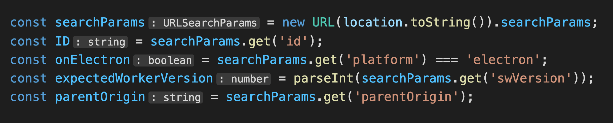
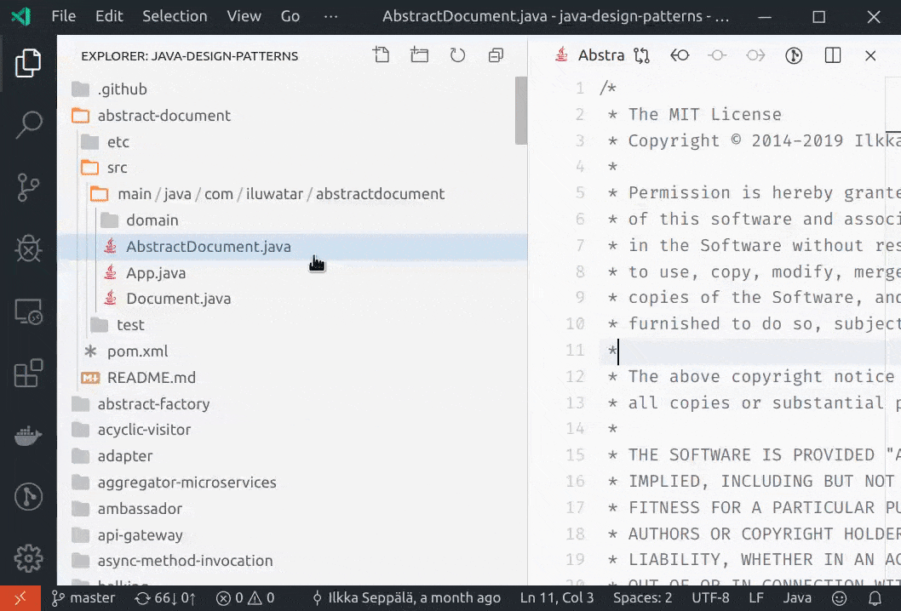
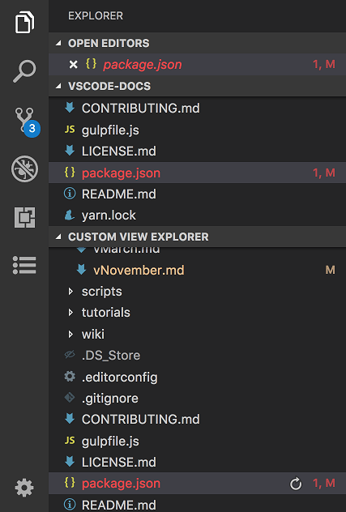
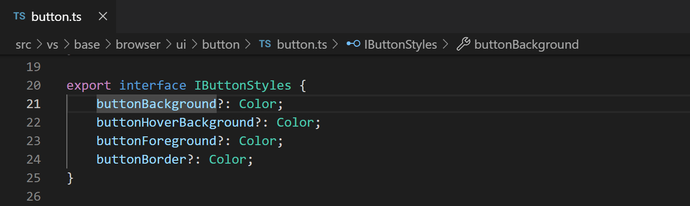

## Awesome VS Code Settings

A curated list of simple and awesome [Visual Studio Code](https://code.visualstudio.com/) settings — `settings.json`.

**_This list is continuously updated._** - You can make a pull requests and contribute.

&nbsp;

## Contents

- [Editor](#editor)
  - [Better Comments](#better-comments) - Improve code readability with custom comment styles.
  - [Custom Editor Labels](#custom-editor-labels) - Personalize editor tab labels for better file identification.
  - [Hide Inlay Hints](#hide-inlay-hints) - Hide inlay hints in the editor for a cleaner view.
  - [Files Auto Save](#files-auto-save) - Automatically save files after a specified delay.
  - [Automatically Fold Imports](#automatically-fold-imports) - Automatically fold imports in the editor.
- [Explorer](#explorer)
  - [Compact Folders in Explorer](#compact-folders-in-explorer) - Disable displaying folders in compact form in the Explorer view.
  - [Disable File Decorations](#disable-file-decorations) - Disable file decorations (Git, problems) in the Explorer view.
  - [Explorer File Nesting](#explorer-file-nesting) - Nesting generated files under source files in the Explorer.
  - [Sort Files in Explorer](#sort-files-in-explorer) - Sort files order by type in the Explorer.
- [Search](#search)
  - [Exclude Files from Search](#exclude-files-from-search) - Exclude specific files or directories from search results.
  - [Show Line Numbers For Search Results](#show-line-numbers-for-search-results) - Show line numbers for search results.
  - [Smart Case Sensitivity in Search](#smart-case-sensitivity-in-search) - Enable smart case sensitivity in search.
- [Source Control](#source-control)
  - [Source Control Font Family](#source-control-font-family) - Customize the font family for the source control view.
  - [Source Control Min & Max Lines](#source-control-min--max-lines) - Set the minimum and maximum number of lines to display.
  - [Source Control Vertical Column Rulers](#source-control-vertical-column-rulers) - Add vertical column rulers to the source control view.
- [User Interface](#user-interface)
  - [Default Settings Editor](#default-settings-editor) - Open the JSON file editor as the default Settings editor.
  - [Hide Command Center](#hide-command-center) - Hide the Command Center to reduce visual clutter.
  - [Hide Breadcrumbs](#hide-breadcrumbs) - Hide the breadcrumbs navigation bar.
- [Miscellaneous](#miscellaneous)
  - [Related lists](#related-lists) - Links to other awesome lists.

&nbsp;

## Editor

### Better Comments

#### Overview

Comments are an essential part of code documentation, providing context, explanations, and reminders for developers. However, traditional comments can sometimes be monotonous and lack visual distinction, making it challenging to differentiate between different types of comments. With the `Better Comments` extension in VS Code, you can enhance the readability and organization of your codebase by using custom comment styles that highlight and categorize comments based on their purpose.

#### How to Solve the Issue

To get started with Better Comments, install the extension from the [VS Code Marketplace](https://marketplace.visualstudio.com/items?itemName=aaron-bond.better-comments). Once installed, you can define custom comment styles in your IDE settings to differentiate between various types of comments. These styles can include different colors, fonts, and backgrounds to make comments stand out and convey their meaning more effectively.

To configure custom comment styles, you can define rules in your `settings.json` file that specify the comment syntax and the corresponding style properties. For example, you can create rules for highlighting important comments in red, informational comments in blue, and TODO comments in yellow. By customizing the appearance of comments, you can improve code readability and quickly identify relevant information within your codebase.

#### Setting

<details>
<summary>Click to expand</summary>

```json
"better-comments.tags": [
  {
    "tag": "!",
    "color": "#FF6961",
    "strikethrough": false,
    "underline": false,
    "backgroundColor": "transparent",
    "bold": false,
    "italic": false
  },
  {
    "tag": "?",
    "color": "#AEC6CF",
    "strikethrough": false,
    "underline": false,
    "backgroundColor": "transparent",
    "bold": false,
    "italic": false
  },
  {
    "tag": "//",
    "color": "#474747",
    "strikethrough": true,
    "underline": false,
    "backgroundColor": "transparent",
    "bold": false,
    "italic": false
  },
  {
    "tag": "[]",
    "color": "#FEFE95",
    "strikethrough": false,
    "underline": false,
    "backgroundColor": "transparent",
    "bold": false,
    "italic": false
  },
  {
    "tag": "[x]",
    "color": "#FEFE95",
    "strikethrough": true,
    "underline": false,
    "backgroundColor": "transparent",
    "bold": false,
    "italic": false
  },
  {
    "tag": "*",
    "color": "#B19CD9",
    "strikethrough": false,
    "underline": false,
    "backgroundColor": "transparent",
    "bold": false,
    "italic": false
  }
]
```

</details>

### Custom Editor Labels

#### Overview

When working on projects with multiple files having the same name, it can be challenging to differentiate between them in the editor tabs or the Open Editors view. This issue can lead to confusion and inefficiency in managing your workspace. Fortunately, with the custom editor labels feature in your IDE, you can personalize the display labels for editor tabs, making it easier to identify and navigate between files with similar names.

#### How to Solve the Issue

To begin, ensure that custom labels are enabled in your IDE settings. Also, you'll need to define custom patterns that match specific file paths and specify how you want the editor tabs to be labeled. Each entry in this setting should consist of a [glob pattern](https://code.visualstudio.com/docs/editor/glob-patterns) and a corresponding template for the editor tab label.

In the template, you can utilize variables such as `${filename}`, `${extname}`, `${dirname}`, and `${dirname(N)}` to dynamically replace values from the file's path. Tailor these templates according to your preference to create unique labels for your editor tabs.

#### Example

Suppose you're working on a project with multiple CSS files located in different directories, all named `styles.css` like `src\home\styles.css` & `src\layout\styles.css`. To differentiate between them, you can define custom labels based on the file's directory:

```json
"workbench.editor.customLabels.enabled": true,
"workbench.editor.customLabels.patterns": {
    "src/**/*.css": "/${dirname} ${filename}.${extname}"
}
```

With this configuration, the editor tabs will display labels like `/home styles.css`, `/layout styles.css`, etc., providing clarity and ease of navigation.

[](https://code.visualstudio.com/assets/updates/1_88/custom-editor-labels.mp4)

<sup>_Source: [Visual Studio Code - Custom Editor Labels](https://code.visualstudio.com/updates/v1_88#_custom-labels-for-open-editors)_</sup>

### Hide Inlay Hints

#### Overview

Inlay hints are annotations displayed in the editor to provide additional context about the code, such as parameter names, types, and return values. While these hints can be helpful for understanding the codebase, they may also clutter the editor view and distract you from the primary task at hand. To maintain focus and reduce visual noise, you can choose to hide inlay hints in your IDE settings.



#### How to Solve the Issue

To disable inlay hints in your editor, you can adjust the corresponding setting in your IDE configuration. By setting the `editor.inlayHints.enabled` option to `false`, you can turn off the display of inlay hints and achieve a cleaner, distraction-free editing experience.

I prefer to use the option `offUnlessPressed` to hide inlay hints by default and only show them when pressing <kbd>Ctrl</kbd>+<kbd>Alt</kbd> key.

#### Setting

```json
"editor.inlayHints.enabled": "offUnlessPressed"
```

This will hide inlay hints by default and only display them when pressing the specified key combination. This setting allows you to focus on your code without the distraction of inlay hints cluttering the editor view.

### Files Auto Save

#### Overview

Auto-saving files in your IDE can help streamline your workflow, reduce manual effort, and ensure that your changes are persisted without the need to manually save each file. By enabling auto-save, you can automate the process of saving files at regular intervals or when switching focus between different files or applications.

#### How to Solve the Issue

To configure auto-save settings in VS Code, you can adjust the `files.autoSave` option in your `settings.json` file. This setting allows you to define when files should be automatically saved based on specific triggers or time intervals. You can choose from various auto-save modes, such as `off`, `afterDelay`, `onWindowChange`, and `onFocusChange`, to customize the auto-save behavior according to your preferences.

#### Setting

```json
"files.autoSave": "afterDelay",
"files.autoSaveDelay": 1000
```

In this example, the auto-save mode is set to `afterDelay`, which saves files after a specified delay of 1000 milliseconds (1 second). You can adjust the `files.autoSaveDelay` value based on your preference to control how frequently files are saved automatically.

### Automatically Fold Imports

#### Overview

When working with code files that contain numerous imports, the editor view can become cluttered and difficult to navigate. To improve code readability and focus on the essential parts of your codebase, you can automatically fold import statements in your IDE. By collapsing import blocks, you can hide non-essential code sections and reduce visual noise in the editor view.

#### Setting

```json
"editor.foldingImportsByDefault": true
```

Once enabled, this setting will automatically fold import statements when opening code files, providing a cleaner and more organized view of your codebase. You can expand or collapse the import blocks manually as needed to view or hide the import statements.

## Explorer

### Compact Folders in Explorer

#### Overview

The Explorer view in VS Code provides a hierarchical representation of your project's file structure, allowing you to navigate and manage files and folders efficiently. By default, single child folders are displayed in a compact form, which can help reduce visual clutter and improve the readability of the Explorer view.



<sup>_Source: [Visual Studio Code - Compact folders in Explorer](https://code.visualstudio.com/updates/v1_41#_compact-folders-in-explorer)_</sup>

However, if you prefer to see all folders expanded for better visibility and navigation, you can disable the compact folders feature in your IDE settings.

#### How to Solve the Issue

To expand all folders in the Explorer view and disable the compact folders feature, you can adjust the `explorer.compactFolders` setting in your `settings.json` file. By setting this option to `false`, you can ensure that all folders are expanded by default, providing a detailed overview of your project's file structure.

#### Example

Let's say you have a project with multiple single child folders like:

```plaintext
src
├── components
│   ├── button.jsx
```

With the `explorer.compactFolders` setting enabled, the Explorer view will display the folders in a compact form like `src \ components \ button.jsx` in a single line. To disable compact folders, add the following setting to your `settings.json` file:

```json
"explorer.compactFolders": false
```

By disabling this setting, the folders will be now expanded to show all levels like `src` and `components`, making it easier to navigate and locate files within your project.

### Disable File Decorations

#### Overview

File decorations in the Explorer view provide visual indicators for files and folders based on their status, such as Git changes, problems, and SCM providers. While these decorations can be helpful for tracking changes and identifying issues in your project, they may also introduce visual noise and clutter the Explorer view.



To reduce distractions and focus on the essential file information, you can choose to disable file decorations in the Explorer view by customizing your IDE settings.

#### Setting

```json
"explorer.decorations.badges": false,
"explorer.decorations.colors": false
```

Once you disable file decorations using these settings, the Explorer view will no longer display badges or colors for files and folders, providing a cleaner and more streamlined view of your project structure.

### Explorer File Nesting

#### Overview

When working on projects with nested file structures, it can be challenging to maintain a clear and organized view of your files in the Explorer. By default, VS Code displays generated files alongside source files in the Explorer view, which can lead to visual clutter and make it difficult to distinguish between different types of files.

To improve the organization and readability of your project files, you can enable file nesting in the Explorer view. This feature groups generated files under their corresponding source files, creating a more structured and intuitive representation of your project's file hierarchy.

#### Setting

```json
"explorer.fileNesting.enabled": true,
"explorer.fileNesting.expand": false,
"explorer.fileNesting.patterns": {
  "*.scss": "${capture}.css",
  ".eslintrc.*": ".eslintignore, .editorconfig, .prettierrc",
},
```

These settings enable file nesting in the Explorer view and collapse the nested files by default. You can also control how the files are nested and displayed by adjusting the `explorer.fileNesting.patterns` option. VS Code by default provides patterns for common file types, but you can customize these patterns to suit your project's specific requirements.


### Sort Files in Explorer

#### Overview

When working on projects with multiple files and folders, it's essential to maintain a well-organized file structure for efficient navigation and management. By default, VS Code sorts files and folders in the Explorer view alphabetically, which may not always align with your preferred ordering or grouping of files.

#### Setting

```json
"explorer.sortOrder": "type"
```

By setting the option to `type`, you can group files and folders by type in the Explorer view. This sorting order categorizes files based on their type, such as directories, files, and symbolic links, providing a more structured and organized view of your project's file hierarchy.

## Search

### Exclude Files from Search

#### Overview

When searching for files or content within your project, you may encounter irrelevant results from directories or files that you don't want to include in the search. This can clutter the search output and make it harder to find the information you're looking for. To streamline your search experience and focus on relevant files, you can exclude specific directories or files from search results using the `files.exclude` setting in your IDE configuration.

#### How to Solve the Issue

To exclude files or directories from search results, you can define [glob patterns](https://code.visualstudio.com/docs/editor/glob-patterns) in your `settings.json` file that match the paths you want to ignore. By specifying these patterns in the `files.exclude` setting, you can prevent the search feature from indexing or displaying files that match the defined criteria.

#### Example

Suppose you want to exclude the `node_modules` directory and all `.log` files from search results in your project. You can achieve this by adding the following entries to your `settings.json` file:

```json
"files.exclude": {
    "**/node_modules": true,
    "**/node_modules/**": true,
    "**/*.log": true
}
```

### Show Line Numbers For Search Results

#### Overview

When searching for text within your project files, it can be helpful to see line numbers alongside the search results to quickly identify the location of the matches. By displaying line numbers for search results, you can navigate to specific lines more efficiently and gain a better understanding of the context in which the search terms appear.

#### Setting

```json
"search.showLineNumbers": true
```

By setting the `search.showLineNumbers` option to `true`, you can display line numbers for search results in the search view. This setting enhances the search experience by providing additional context and reference points for the search matches found in your project files.

### Smart Case Sensitivity in Search

#### Overview

When performing searches in VS Code, you may encounter situations where you want to match the case of the search term based on the context of the query. By enabling smart case sensitivity in search, you can dynamically adjust the case sensitivity of the search based on the presence of uppercase or lowercase characters in the search query.

#### Setting

```json
"search.smartCase": true
```

When enabled, VS Code will conduct a case-sensitive search if your query includes any uppercase letters. Conversely, if your search query is all lowercase, the search will be case-insensitive.

For instance, if you search for "code" it will find both "code" and "Code". However, if you search for "Code" it will only return results that exactly match "Code".

## Source Control

### Source Control Font Family

#### Overview

The source control view in VS Code provides a visual representation of changes made to your repository, allowing you to track, commit, and manage code modifications efficiently. However, the default font family used in the source control view may not align with your preferred coding environment or theme. To enhance the appearance and readability of the source control view, you can customize the font family used in this section of the IDE.

#### How to Solve the Issue

To change the font family in the source control view, you can modify the `scm.inputFontFamily` setting in your `settings.json` file. By specifying the desired font family, you can update the appearance of the source control view to match your coding preferences and improve the overall visual consistency of the IDE.

#### Setting

```json
"scm.inputFontFamily": "'Cascadia Code', Consolas, monospace"
```

In this example, the font family for the source control view is set to `'Cascadia Code', Consolas, monospace`, which prioritizes the `Cascadia Code` font but falls back to `Consolas` and generic `monospace` fonts if the primary choice is unavailable.

### Source Control Min & Max Lines

#### Overview

When working with source control in VS Code, you may want to customize the number of lines displayed in the source control "Message" input field. By default, the input field shows a single line, which may not be sufficient to provide detailed information about the changes being committed. To address this limitation and enhance the visibility of source control changes, you can configure the minimum and maximum number of lines to display in the source control view.

#### How to Solve the Issue

By setting the `scm.inputMinLineCount` and `scm.inputMaxLineCount` options, you can define the minimum and maximum number of lines to display in the source control "Message" input field. These settings allow you to specify the range of lines that should be visible when entering commit messages, providing more space to describe the changes made to the files in your repository.

#### Setting

```json
"scm.inputMinLineCount": 3,
"scm.inputMaxLineCount": 10,
```

With these settings, the source control "Message" input field will display a minimum of 3 lines and a maximum of 10 lines, giving you ample space to describe your commit changes in detail.

### Source Control Vertical Column Rulers

#### Overview

Column rulers are vertical lines displayed in the editor to help you visualize and align code elements based on specific character positions. While column rulers are commonly used in the editor view, they can also be beneficial in other sections of the IDE, such as the source control "Message" input field. By adding vertical column rulers to the source control view, you can improve code readability, alignment, and consistency when entering commit messages or viewing source control information.

#### How to Solve the Issue

To enable vertical column rulers in the source control "Message" input field, you can configure the `[scminput]` setting in your `settings.json` file. This setting allows you to define an array of column positions where vertical rulers should be displayed in the source control view. By specifying these positions, you can create visual guides that help you align and format commit messages effectively.

#### Setting

```json
"[scminput]": {
  "editor.rulers": [50, 72],
  "editor.wordWrap": "off"
}
```

In this example, two vertical column rulers are added at character positions 50 and 72 in the source control "Message" input field. These rulers provide visual cues for aligning text and maintaining consistent formatting when entering commit messages.

**Quick Tip:** You can also disable word wrapping in the source control "Message" input field by setting `"editor.wordWrap": "off"`. This ensures that long lines of text are not wrapped, allowing you to view and edit commit messages without line breaks.

You can read more about [Git Commit Message with the 50/72 Rule](https://dev.to/noelworden/improving-your-commit-message-with-the-50-72-rule-3g79) here.

## User Interface

### Default Settings Editor

#### Overview

The default settings editor in VS Code allows you to view and modify your IDE settings using a graphical interface, making it easier to customize your coding environment. You can access this editor by navigating to `File > Preferences > Settings` or by pressing <kbd>Ctrl</kbd>+<kbd>,</kbd>. However, if you prefer to work with settings in a `JSON` file format for better readability and version control, you can set the JSON file editor as the default settings editor in your IDE.

#### Setting

```json
"workbench.settings.editor": "json"
```

Now you can open the settings editor as a `JSON` file by default, allowing you to manage your settings in a structured format.

### Hide Command Center

#### Overview

The Command Center in VS Code provides quick access to various commands, settings, and features within the IDE, allowing you to perform tasks efficiently using keyboard shortcuts or search functionality.


While the Command Center can be a powerful tool for navigating the IDE, it may also occupy valuable screen space and distract you from your primary coding tasks. To maximize your editor view and reduce visual clutter, you can choose to hide the Command Center when not in use.

#### Setting

```json
"window.commandCenter": false
```

By setting the `window.commandCenter` option to `false`, you can hide the Command Center in VS Code. This setting allows you to focus on your code without the distraction of the Command Center panel.

### Hide Breadcrumbs

#### Overview

The breadcrumbs navigation bar in VS Code provides a visual representation of the current file's path, allowing you to navigate through directories and access parent folders easily. It is located at the top of the editor view and displays the file hierarchy in a clickable format.



While breadcrumbs can be a useful tool for understanding the file structure and hierarchy, they may also occupy valuable screen space and distract you from your primary coding tasks. To maximize your editor view and reduce visual clutter, you can choose to hide the breadcrumbs navigation bar when not in use.

#### Setting

```json
"breadcrumbs.enabled": false
```

By setting the `breadcrumbs.enabled` option to `false`, you can hide the breadcrumbs navigation bar in VS Code. This setting allows you to focus on your code without the distraction of the breadcrumbs panel.

## Miscellaneous

### Related lists

- [awesome-js-posts](https://github.com/palashmon/awesome-js-posts) - Posts, blogs and repositories related to JavaScript.
